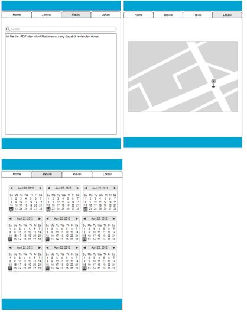

# Aplikasi Bimbingan Online Tugas Akhir Berbasis Android

## Penjelasan
Beberapa perguruan tinggi di Indonesia senantiasa melakukan pengembangan dari berbagai bidang termasuk sistem informasi akademik yang dimilikinya seperti web site resmi, aplikasi SIAM, aplikasi keuangan dan lainnya. Namun hingga saat ini beberapa Perguruan tinggi ini belum menerapkan sistem pengendalian Tugas Akhir atau Skripsi berbasis aplikasi website atau mobile. Masih banyak aktifitas yang dilakukan secara manual seperti mengisi formulir pendaftaran, pelaporan hasil bimbingan dan lain sebagainya. Pemanfaatan TIK terutama penerapan penggunaan sistem informasi pada bidang layanan administrasi akademik di perguruan tinggi saat ini menjadi suatu kebutuhan wajib supaya dapat meningkatkan daya saing perguruan tinggi. Tidak lepas dengan permasalahan pada beberapa perguruan tinggi yaitu masih melakukan bimbingan skripsi manual atau offline yang nantinya dapat membuang waktu ketika menunggu dosen tanpa melihat lokasi dosen atau mahasiswa, dengan adanya aplikasi ini akan bisa mengurangi resiko menunggu lama antara dosen dan mahasiswa. Serta di dalam aplikasi ini bisa di improve dengan memberi fiture penjadwalan bimbingan. 
Sehingga isi atau fitur dari aplikasi ini yang pertama adalah bimbingan skripsi online, mahasiswa bisa melakukan bimbingan online dengan mengupload file pdf/word, yang nantinya dosen dapat merevisi dengan cara memberi keterangan langsung di dalam file tersebut seperti mencoret-coret yang selayaknya bimbingan skripsi offline, dan dapat melakukan penyimpanan file tersebut dan dapat di lihat oleh mahasiswa bimbingannya. Kedua yaitu bisa saling melakukan sharing location antara mahasiswa dan dosen pembimbing, semisal lokasi dosen masih belum berada di lingkungan kampus, maka map akan offline sendirinya, sebaliknya jika dosen berada di lingkup kampus maka lokasi atau map akan online otomatis dan dapat mendeteksi lokasi dosen berada, yang nantinya dapat di visualisasikan dengan notifikasi atau pemberitahuan pesan masuk kepada mahasiswa jika dosen sudah berada di lingkup kampus. Untuk lokasi mahasiswa sendiri selalu online yang dapat di pantau oleh dosen, sehingga sebelum dosen datang ke kampus dapat di pastikan mahasiswa tersebut sudah berada di kampus, tanpa dosen menerima pesan pemberitahuan dari mahasiswanya terlebih dahulu. Ketiga yaitu mahasiswa dapat membuat jadwal bimbingan dengan dosen, yang nanti akan di approve oleh dosen. Jika sudah dilakukan approve oleh dosen, dan tanggal sesuai yang ditulis maka akan muncu pemberitahuan atau reminder pada mahasiswa dan juga dosen bahwa hari tersebut ada jadwal bimbingan.
Dari Ketiga fitur tersebut akan dapat mengurangi permasalahan menuggu terlalu lama antara dosen dan mahasiswa, mengurangi kertas atau paperless untuk melakukan bimbingan skripsi sehingga kita juga akan ikut dalam menjaga bumi, selain itu juga akan mengurangi miss komunikasi antara mahasiswa dosen dalam melakukan bimbingan tugas akhir atau skripsi. 

## Gambar Mockup Contoh Fitur

